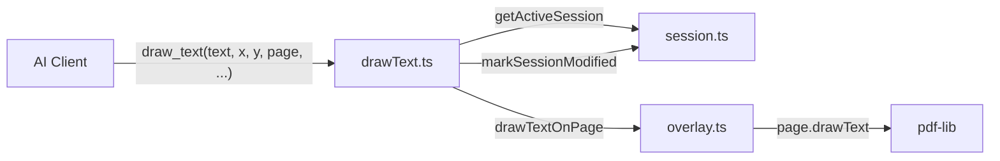

# Task 1.3: draw_text Tool Implementation

## Overview

Create an MCP tool that exposes the text overlay functionality to AI clients. The core `drawTextOnPage()` function already exists in [`src/pdf/overlay.ts`](src/pdf/overlay.ts) - this task wraps it as an MCP tool.

## Architecture



## Implementation

### 1. Create Tool File

**File:** [`src/tools/drawText.ts`](src/tools/drawText.ts) (new)

```typescript
import type { McpServer } from '@modelcontextprotocol/sdk/server/mcp.js';
import { z } from 'zod';
import { drawTextOnPage } from '../pdf/overlay.js';
import { getActiveSession, markSessionModified } from '../state/session.js';
import { formatToolError } from '../utils/errors.js';

/**
 * Register the draw_text tool for placing text at specific coordinates.
 * This enables AI clients to fill static forms by drawing text at positions.
 */
export function registerDrawTextTool(server: McpServer): void {
  server.registerTool(
    'draw_text',
    {
      description: 'Draw text at specific coordinates on a PDF page',
      inputSchema: {
        text: z.string().describe('Text to draw on the page'),
        x: z.number().describe('X coordinate (points from left edge)'),
        y: z.number().describe('Y coordinate (points from bottom edge)'),
        page: z.number().int().min(1).describe('Page number (1-indexed)'),
        fontSize: z.number().optional().default(12).describe('Font size in points'),
        fontName: z.enum(['Helvetica', 'TimesRoman', 'Courier']).optional().default('Helvetica').describe('Standard font name'),
      },
    },
    async ({ text, x, y, page, fontSize, fontName }) => {
      try {
        // 1. Get active session (throws if no PDF open)
        const session = getActiveSession();

        // 2. Draw text using overlay module
        const result = await drawTextOnPage(session.document, {
          text,
          x,
          y,
          page,
          fontSize,
          fontName,
        });

        // 3. Mark session as modified
        markSessionModified();

        // 4. Return success message
        return {
          content: [
            {
              type: 'text',
              text: `Drew "${result.text}" at (${result.x}, ${result.y}) on page ${result.page} with ${result.fontName} ${result.fontSize}pt`,
            },
          ],
        };
      } catch (error) {
        return {
          content: [
            {
              type: 'text',
              text: formatToolError(error),
            },
          ],
          isError: true,
        };
      }
    }
  );
}
```

### 2. Register Tool

**File:** [`src/tools/index.ts`](src/tools/index.ts)

- Import `registerDrawTextTool` from `./drawText.js`
- Add call to `registerDrawTextTool(server)` in `registerTools()`

### 3. Integration Tests

**File:** [`tests/tools/drawText.test.ts`](tests/tools/drawText.test.ts) (new)

Following the pattern from [`tests/tools/getTextWithPositions.test.ts`](tests/tools/getTextWithPositions.test.ts):

| Test Case | Description |

|-----------|-------------|

| Basic draw | Draw text with default font/size, verify success message format |

| Custom font/size | Test with `fontSize: 14, fontName: 'Courier'` |

| No PDF open | Should return `isError: true` with "No active PDF session" |

| Invalid page | Page 999 should error with "Invalid page number" and page count |

| Out of bounds X | X > page width should error with "out of bounds" |

| Out of bounds Y | Y > page height should error with "out of bounds" |

| Session modified | Verify session `isModified` is true after successful draw |

| Multi-page | Draw on page 2 of multi-page PDF, verify success |

**Test Structure:**

```typescript
import { test, describe, expect } from '../fixtures/index.js';
import { clearSession, getActiveSession } from '../../src/state/session.js';

interface ToolResponseContent {
  type: string;
  text?: string;
}

describe('draw_text tool', () => {
  test.beforeEach(() => {
    clearSession();
  });

  test('should draw text with default options', async ({ client, pdfs }) => {
    await client.callTool({ name: 'open_pdf', arguments: { path: pdfs.simpleForm } });
    
    const result = await client.callTool({
      name: 'draw_text',
      arguments: { text: 'Hello', x: 100, y: 700, page: 1 },
    });

    expect(result.isError).not.toBe(true);
    const content = result.content as ToolResponseContent[];
    expect(content[0].text).toContain('Drew "Hello"');
    expect(content[0].text).toContain('(100, 700)');
    expect(content[0].text).toContain('page 1');
  });

  // ... additional tests follow same pattern
});
```

## Files Changed

| File | Change |

|------|--------|

| `src/tools/drawText.ts` | New - Tool implementation (~60 lines) |

| `src/tools/index.ts` | Add import + registration (2 lines) |

| `tests/tools/drawText.test.ts` | New - Integration tests (~150 lines) |

## Quality Gates

After implementation:

```bash
pnpm run check  # lint + typecheck + test
```

All existing tests must continue to pass, plus 8 new tests for draw_text.