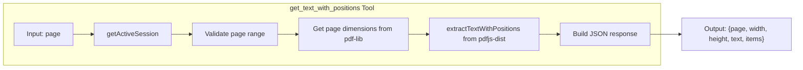

# Task 1.2: get_text_with_positions Tool

## Overview

Create an MCP tool that returns text items with their positions (x, y, width, height) and page dimensions, enabling AI clients to analyze PDF layouts and determine where to place text for static form filling.

## Architecture



## Implementation

### 1. Create Tool Handler

**New file:** `src/tools/getTextWithPositions.ts`

**Required Imports:**

```typescript
import type { McpServer } from '@modelcontextprotocol/sdk/server/mcp.js';
import { z } from 'zod';
import { extractTextWithPositions } from '../pdf/text.js';
import { getActiveSession } from '../state/session.js';
import { PdfInvalidPageError } from '../pdf/errors.js';
import { formatToolError } from '../utils/errors.js';
```

**Full Implementation:**

```typescript
/**
 * Register the get_text_with_positions tool for extracting text with coordinates.
 * This enables AI clients to analyze PDF layouts for static form filling.
 */
export function registerGetTextWithPositionsTool(server: McpServer): void {
  server.registerTool(
    'get_text_with_positions',
    {
      description: 'Get text content with x, y coordinates for each text item on a page',
      inputSchema: {
        page: z.number().int().min(1).describe('Page number (1-indexed)')
      }
    },
    async ({ page }) => {
      try {
        // 1. Get active session (throws if no PDF open)
        const session = getActiveSession();

        // 2. Validate page number BEFORE calling extractTextWithPositions (fail fast)
        if (page > session.pageCount) {
          throw new PdfInvalidPageError(page, session.pageCount);
        }

        // 3. Get page dimensions from pdf-lib (0-indexed)
        const pdfPage = session.document.getPage(page - 1);
        const width = pdfPage.getWidth();
        const height = pdfPage.getHeight();

        // 4. Extract text with positions using pdfjs-dist
        const pageText = await extractTextWithPositions(session.filePath, page);

        // 5. Return JSON response with page info, dimensions, and text items
        return {
          content: [
            {
              type: 'text',
              text: JSON.stringify({
                page,
                width,
                height,
                text: pageText.text,
                items: pageText.items ?? [],
              }, null, 2),
            },
          ],
        };
      } catch (error) {
        return {
          content: [
            {
              type: 'text',
              text: formatToolError(error),
            },
          ],
          isError: true,
        };
      }
    }
  );
}
```

**Key implementation details:**

- Use `session.document.getPage(page - 1)` for pdf-lib (0-indexed)
- Use `.getWidth()` and `.getHeight()` for page dimensions
- Validate page range BEFORE calling extractTextWithPositions (fail fast pattern)
- Keep floating-point precision for coordinates (no rounding)
- Include both `.text` (concatenated) and `.items[]` in response
- Follow error handling pattern from `getPageContent.ts`

### 2. Register Tool

**Modify:** `src/tools/index.ts`

```typescript
// Add import
import { registerGetTextWithPositionsTool } from './getTextWithPositions.js';

// Add to registerTools function
export function registerTools(server: McpServer): void {
  registerOpenPdfTool(server);
  registerListFieldsTool(server);
  registerGetFieldContextTool(server);
  registerFillFieldTool(server);
  registerPreviewPdfTool(server);
  registerSavePdfTool(server);
  registerGetPageContentTool(server);
  registerGetTextWithPositionsTool(server);  // NEW
}
```

### 3. Write Tests

**New file:** `tests/tools/getTextWithPositions.test.ts`

**Test cases:**

| Test | Description |

|------|-------------|

| Extract text with positions | Verify basic extraction from simple-form.pdf |

| Verify page dimensions | Check width=612, height=792 for letter size PDF |

| Verify item properties | Each item has text, x, y, width, height |

| Verify text concatenation | The `text` field contains all item texts joined |

| Multi-page extraction | Test page 1 and page 2 from multi-page.pdf |

| Error: no PDF open | Returns `isError: true` with session error message |

| Error: invalid page | Returns `isError: true` for page > pageCount |

**Test Structure (following getPageContent.test.ts pattern):**

```typescript
import { test, describe, expect } from '../fixtures/index.js';
import { clearSession } from '../../src/state/session.js';

interface ToolResponseContent {
  type: string;
  text?: string;
}

interface TextPositionItem {
  text: string;
  x: number;
  y: number;
  width: number;
  height: number;
}

interface TextPositionResponse {
  page: number;
  width: number;
  height: number;
  text: string;
  items: TextPositionItem[];
}

describe('get_text_with_positions tool', () => {
  test.beforeEach(() => {
    clearSession();
  });

  test('should extract text with positions', async ({ client, pdfs }) => {
    await client.callTool({ name: 'open_pdf', arguments: { path: pdfs.simpleForm } });
    
    const result = await client.callTool({
      name: 'get_text_with_positions',
      arguments: { page: 1 },
    });

    const content = result.content as ToolResponseContent[];
    expect(content).toHaveLength(1);
    expect(content[0].type).toBe('text');
    
    const response = JSON.parse(content[0].text!) as TextPositionResponse;
    expect(response.page).toBe(1);
    expect(typeof response.width).toBe('number');
    expect(typeof response.height).toBe('number');
    expect(typeof response.text).toBe('string');
    expect(Array.isArray(response.items)).toBe(true);
  });

  test('should return correct page dimensions for letter size', async ({ client, pdfs }) => {
    await client.callTool({ name: 'open_pdf', arguments: { path: pdfs.simpleForm } });
    
    const result = await client.callTool({
      name: 'get_text_with_positions',
      arguments: { page: 1 },
    });

    const response = JSON.parse((result.content as ToolResponseContent[])[0].text!) as TextPositionResponse;
    expect(response.width).toBe(612);
    expect(response.height).toBe(792);
  });

  // ... additional tests for items validation, multi-page, errors
});
```

## Output Format

```json
{
  "page": 1,
  "width": 612,
  "height": 792,
  "text": "Name: _______________ Email: _______________",
  "items": [
    { "text": "Name:", "x": 50.0, "y": 700.5, "width": 35.2, "height": 12.0 },
    { "text": "_______________", "x": 95.0, "y": 700.5, "width": 100.0, "height": 12.0 }
  ]
}
```

## Files to Change

| File | Change |

|------|--------|

| `src/tools/getTextWithPositions.ts` | NEW - Tool implementation |

| `src/tools/index.ts` | Add import and registration |

| `tests/tools/getTextWithPositions.test.ts` | NEW - Integration tests |

## Existing Code Dependencies

| Module | Function/Type | Purpose |

|--------|---------------|---------|

| `src/pdf/text.ts` | `extractTextWithPositions()` | Returns `PageText` with items array |

| `src/pdf/types.ts` | `TextItem`, `PageText` | Type definitions for text items |

| `src/state/session.ts` | `getActiveSession()` | Access active PDF session |

| `src/pdf/errors.ts` | `PdfInvalidPageError` | Page validation error |

| `src/utils/errors.ts` | `formatToolError()` | Error message formatting |

## Quality Gates

- `pnpm test` - all tests pass
- `pnpm run lint` - no lint errors  
- `pnpm run build` - builds successfully