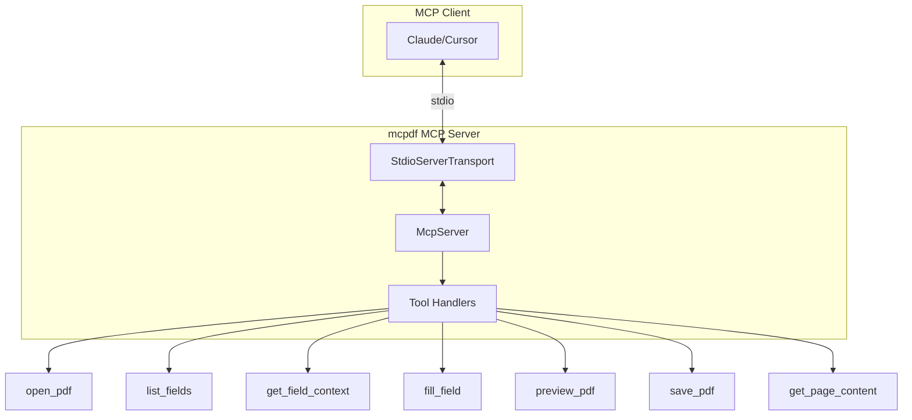

# Task 1.2: MCP Server Setup

## Overview

Transform the placeholder entry point into a working MCP server that can be added to Claude/Cursor MCP configuration. This establishes the foundation for all PDF tools.

## Architecture



## Implementation Steps

### Step 1: Install MCP SDK

Install the official MCP TypeScript SDK:

```bash
pnpm add @modelcontextprotocol/sdk
```

### Step 2: Implement MCP Server Entry Point

Update [`src/index.ts`](src/index.ts) to:

1. Import MCP SDK components (`McpServer`, `StdioServerTransport`)
2. Create server instance with:

   - Name: `mcpdf`
   - Version: `0.1.0`
   - Capabilities: `{ tools: {} }`

3. Set up stdio transport
4. Add main function with proper error handling
5. Use shebang for CLI execution (`#!/usr/bin/env node`)

Pattern from [`context/resources/MCP_EXAMPLES.md`](context/resources/MCP_EXAMPLES.md):

```typescript
const server = new McpServer({
  name: 'mcpdf',
  version: '0.1.0'
}, {
  capabilities: { tools: {} }
});
```

### Step 3: Register Placeholder Tools

Register all 7 tools with Zod input schemas and placeholder handlers that return "not implemented" messages:

| Tool | Input Schema | Purpose |

|------|--------------|---------|

| `open_pdf` | `{ path: z.string() }` | Load PDF file |

| `list_fields` | `{ page?: z.number() }` | List form fields |

| `get_field_context` | `{ fieldName: z.string() }` | Get field details |

| `fill_field` | `{ fieldName: z.string() }` | Fill form field |

| `preview_pdf` | `{}` (no input) | Preview in viewer |

| `save_pdf` | `{ outputPath?: z.string() }` | Save to file |

| `get_page_content` | `{ page: z.number() }` | Extract page text |

Each tool returns a placeholder response:

```typescript
return {
  content: [{ type: 'text', text: 'Tool not yet implemented' }]
};
```

### Step 4: Update Build Configuration

Ensure [`tsdown.config.ts`](tsdown.config.ts) generates executable output:

- Entry point produces `dist/index.mjs`
- Bin entry in [`package.json`](package.json) may need update to `.mjs` extension

### Step 5: Quality Verification

Run all checks to ensure quality gates pass:

```bash
pnpm run check  # lint + typecheck + test
```

### Step 6: Update Progress Tracking

Update [`context/PROGRESS.md`](context/PROGRESS.md):

- Mark Task 1.2 as complete
- Check off all deliverables
- Add change log entry

## Files Modified

| File | Changes |

|------|---------|

| `package.json` | Add `@modelcontextprotocol/sdk` dependency |

| `src/index.ts` | Complete rewrite with MCP server implementation |

| `context/PROGRESS.md` | Update task status |

## Validation Criteria

- [ ] Server starts without errors
- [ ] All 7 tools are registered and callable
- [ ] `pnpm run lint` passes
- [ ] `pnpm run typecheck` passes  
- [ ] `pnpm run test` passes
- [ ] `pnpm run build` produces working output