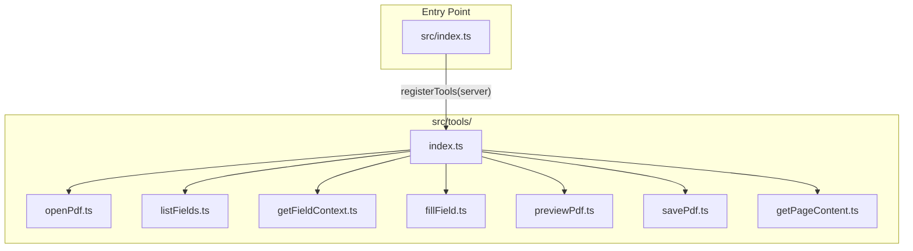

# Task 1.3: Tool Registration Structure

Modularize the existing inline tool definitions into a clean, maintainable directory structure using the correct `registerTool` API.

## API Change: Deprecated to Current

The current code uses deprecated `server.tool()`. Must migrate to `server.registerTool()`:

```typescript
// OLD (deprecated)
server.tool(
  'open_pdf',
  'Description...',
  { path: z.string().describe('...') },
  async ({ path }) => { ... }
);

// NEW (correct)
server.registerTool(
  'open_pdf',
  {
    description: 'Description...',
    inputSchema: { path: z.string().describe('...') },
  },
  async ({ path }) => { ... }
);
```

## Architecture



## Implementation

### 1. Create Tool Directory Structure

Create `src/tools/` with individual files for each tool:

| File | Tool Name | Input Schema |

|------|-----------|--------------|

| `openPdf.ts` | `open_pdf` | `{ path: string }` |

| `listFields.ts` | `list_fields` | `{ page?: number }` |

| `getFieldContext.ts` | `get_field_context` | `{ fieldName: string }` |

| `fillField.ts` | `fill_field` | `{ fieldName: string }` |

| `previewPdf.ts` | `preview_pdf` | `{}` (empty) |

| `savePdf.ts` | `save_pdf` | `{ outputPath?: string }` |

| `getPageContent.ts` | `get_page_content` | `{ page: number }` |

### 2. Tool File Pattern (using registerTool)

Each tool file exports a registration function using the **correct API**:

```typescript
// src/tools/openPdf.ts
import type { McpServer } from '@modelcontextprotocol/sdk/server/mcp.js';
import { z } from 'zod';

export function registerOpenPdfTool(server: McpServer): void {
  server.registerTool(
    'open_pdf',
    {
      description: 'Open a PDF file and get document summary including page count, form fields, and document type',
      inputSchema: {
        path: z.string().describe('Absolute or relative path to the PDF file'),
      },
    },
    async ({ path }) => {
      // TODO: Implement in Task 3.1
      return {
        content: [{ type: 'text', text: `[Not yet implemented] Would open PDF: ${path}` }],
      };
    }
  );
}
```

### 3. Central Registration ([src/tools/index.ts](src/tools/index.ts))

Exports a single `registerTools` function:

```typescript
import type { McpServer } from '@modelcontextprotocol/sdk/server/mcp.js';
import { registerOpenPdfTool } from './openPdf.js';
import { registerListFieldsTool } from './listFields.js';
// ... other imports

export function registerTools(server: McpServer): void {
  registerOpenPdfTool(server);
  registerListFieldsTool(server);
  registerGetFieldContextTool(server);
  registerFillFieldTool(server);
  registerPreviewPdfTool(server);
  registerSavePdfTool(server);
  registerGetPageContentTool(server);
}
```

### 4. Simplify Entry Point ([src/index.ts](src/index.ts))

Refactor to use the modular tools:

```typescript
#!/usr/bin/env node
import { McpServer } from '@modelcontextprotocol/sdk/server/mcp.js';
import { StdioServerTransport } from '@modelcontextprotocol/sdk/server/stdio.js';
import { registerTools } from './tools/index.js';

export const VERSION = '0.1.0';

const server = new McpServer(
  { name: 'mcpdf', version: VERSION },
  { capabilities: { tools: {} } }
);

registerTools(server);

async function main(): Promise<void> {
  const transport = new StdioServerTransport();
  await server.connect(transport);
}

main().catch((error: unknown) => {
  console.error('Failed to start mcpdf server:', error);
  process.exit(1);
});
```

### 5. Quality Verification

Run all checks:

```bash
pnpm run check  # lint + typecheck + test + build
```

## Files to Create/Modify

| Action | File |

|--------|------|

| Create | `src/tools/index.ts` |

| Create | `src/tools/openPdf.ts` |

| Create | `src/tools/listFields.ts` |

| Create | `src/tools/getFieldContext.ts` |

| Create | `src/tools/fillField.ts` |

| Create | `src/tools/previewPdf.ts` |

| Create | `src/tools/savePdf.ts` |

| Create | `src/tools/getPageContent.ts` |

| Modify | `src/index.ts` (simplify, import from tools) |

| Modify | `context/PROGRESS.md` (mark complete) |

## Validation

- All 7 tools remain registered and callable
- No TypeScript deprecation warnings
- `pnpm run lint` passes
- `pnpm run typecheck` passes
- `pnpm run test` passes
- `pnpm run build` succeeds