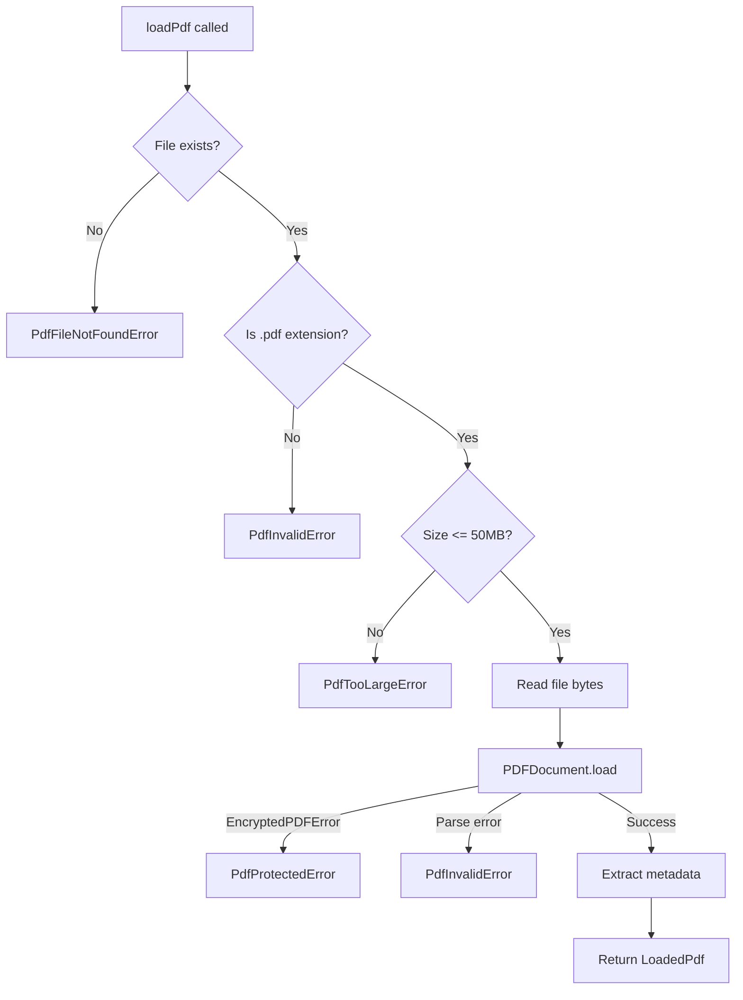

# Task 2.1: PDF Loading Implementation

## Objective

Create `src/pdf/reader.ts` module that loads PDF files using pdf-lib, validates input, and handles error cases (file not found, invalid PDF, password-protected).

## Research Findings

### pdf-lib API (from [Hopding/pdf-lib](https://github.com/Hopding/pdf-lib))

**Loading:**

```typescript
import { PDFDocument } from 'pdf-lib';
const pdfBytes = fs.readFileSync('form.pdf');
const pdfDoc = await PDFDocument.load(pdfBytes);
```

**Load Options:**

```typescript
interface LoadOptions {
  ignoreEncryption?: boolean;  // Skip encryption check
  parseSpeed?: ParseSpeeds;    // Parsing thoroughness
  throwOnInvalidObject?: boolean;
  updateMetadata?: boolean;
  capNumbers?: boolean;
}
```

**Key Errors:**

- `EncryptedPDFError` - Thrown for password-protected PDFs (message contains "encrypted")
- Generic parsing errors for invalid/corrupt PDFs

### Reference Implementation Patterns (from [SylphxAI/pdf-reader-mcp](https://github.com/SylphxAI/pdf-reader-mcp))

The reference uses pdfjs-dist for loading, but our architecture uses pdf-lib for form operations. Key patterns to adopt:

- File existence check before loading
- Size limit validation (we'll use 50MB per PRD)
- Custom error classes with error codes
- ENOENT handling for file not found

## Implementation Plan

### 1. Create Type Definitions

**File:** [`src/pdf/types.ts`](src/pdf/types.ts)

```typescript
// PDF loading result
interface LoadedPdf {
  document: PDFDocument;
  path: string;
  pageCount: number;
  hasForm: boolean;
  fieldCount: number;
}

// Error types enum
enum PdfErrorCode {
  FileNotFound = 'FILE_NOT_FOUND',
  NotAPdf = 'NOT_A_PDF',
  InvalidPdf = 'INVALID_PDF',
  ProtectedPdf = 'PROTECTED_PDF',
  FileTooLarge = 'FILE_TOO_LARGE',
}
```

### 2. Create Error Classes

**File:** [`src/pdf/errors.ts`](src/pdf/errors.ts)

Custom error classes for each error scenario:

- `PdfFileNotFoundError`
- `PdfInvalidError`
- `PdfProtectedError`
- `PdfTooLargeError`

### 3. Implement PDF Reader

**File:** [`src/pdf/reader.ts`](src/pdf/reader.ts)

```typescript
export async function loadPdf(filePath: string): Promise<LoadedPdf>
```

**Validation sequence:**

1. Check file exists (fs.access)
2. Validate `.pdf` extension
3. Check file size (max 50MB per PRD)
4. Read file bytes
5. Load with PDFDocument.load()
6. Catch EncryptedPDFError for protected PDFs
7. Catch parse errors for invalid PDFs
8. Extract basic metadata (pages, form, fields)

### 4. Create Index Export

**File:** [`src/pdf/index.ts`](src/pdf/index.ts)

Export all types and functions from the pdf module.

### 5. Write Unit Tests

**File:** [`tests/pdf/reader.test.ts`](tests/pdf/reader.test.ts)

Test cases:

- Successfully load valid PDF with form fields
- Successfully load valid PDF without fields
- Error: File not found
- Error: Not a PDF file (wrong extension)
- Error: Invalid/corrupt PDF data
- Error: Password-protected PDF (need to create fixture)
- Error: File too large (mock)
- Correctly extract page count
- Correctly detect form presence
- Correctly count fields

### 6. Create Additional Test Fixture

**File:** Update [`tests/pdfs/generator.ts`](tests/pdfs/generator.ts)

Add password-protected PDF fixture for testing (note: pdf-lib cannot create encrypted PDFs, but we can test detection with a pre-made fixture or skip this test).

## File Structure After Implementation

```
src/
├── pdf/
│   ├── index.ts      # Re-exports
│   ├── types.ts      # Type definitions
│   ├── errors.ts     # Custom error classes
│   └── reader.ts     # PDF loading logic
```

## Dependencies

- `pdf-lib` - Already installed (v1.17.1)
- `node:fs/promises` - Built-in Node.js module

## Success Criteria

- All 6 deliverables from PROGRESS.md completed
- Unit tests for happy path and all error cases
- `pnpm run check` passes (lint, typecheck, test)

## Diagram: PDF Loading Flow

