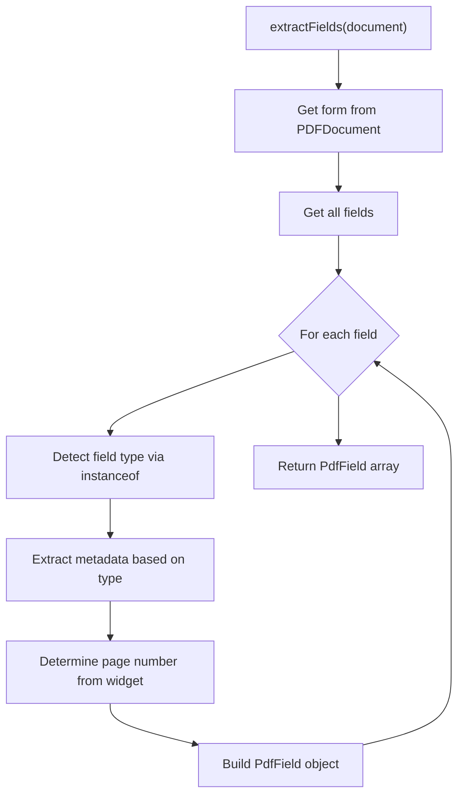

# Task 2.2: Form Field Detection

## Objective

Create a `fields.ts` module that detects and extracts form field metadata from PDF documents using pdf-lib's form API.

## PRD Requirements

From the PRD, the field metadata structure must be:

```typescript
{
  name: string;
  type: 'text' | 'checkbox' | 'radio' | 'dropdown' | 'multiline';
  page: number;
  required: boolean;
  currentValue: string | boolean | null;
  options?: string[];  // For dropdowns/radios
}
```

## Implementation Steps

### 1. Add Field Types to types.ts

**File:** [src/pdf/types.ts](src/pdf/types.ts)

Add:

- `PdfFieldType` enum: `text`, `checkbox`, `radio`, `dropdown`, `multiline`
- `PdfField` interface matching PRD metadata structure
- Add `FieldNotFound` to `PdfErrorCode` enum

### 2. Add FieldNotFoundError to errors.ts

**File:** [src/pdf/errors.ts](src/pdf/errors.ts)

Add `PdfFieldNotFoundError` class for when a field is requested by name but doesn't exist.

### 3. Create fields.ts Module

**File:** `src/pdf/fields.ts` (new)



**Functions:**

- `extractFields(document: PDFDocument): PdfField[]` - Main extraction function
- `getFieldPage(document: PDFDocument, field: PDFField): number` - Determine field's page (from PDF_PATTERNS.md)
- `getFieldByName(document: PDFDocument, fieldName: string): PdfField` - Get single field by name

**Field Type Detection:**

| pdf-lib Type | Our Type | Value Extraction |

|--------------|----------|------------------|

| `PDFTextField` (multiline=false) | `text` | `field.getText()` |

| `PDFTextField` (multiline=true) | `multiline` | `field.getText()` |

| `PDFCheckBox` | `checkbox` | `field.isChecked()` |

| `PDFRadioGroup` | `radio` | `field.getSelected()` |

| `PDFDropdown` | `dropdown` | `field.getSelected()[0]` |

### 4. Update Index Exports

**File:** [src/pdf/index.ts](src/pdf/index.ts)

Export new types and functions from `fields.ts`.

### 5. Add Radio Button to Test Fixtures

**File:** [tests/pdfs/generator.ts](tests/pdfs/generator.ts)

Add a radio button group to `simple-form.pdf` for testing:

```typescript
const genderRadio = form.createRadioGroup('gender');
genderRadio.addOptionToPage('male', page, { x: 50, y: 500, ... });
genderRadio.addOptionToPage('female', page, { x: 50, y: 480, ... });
```

### 6. Write Unit Tests

**File:** `tests/pdf/fields.test.ts` (new)

Test cases:

- Extract all fields from simple-form.pdf (text, checkbox, dropdown, radio)
- Extract fields from multi-page.pdf (verify correct page numbers)
- Extract from empty.pdf (returns empty array)
- Detect multiline text fields correctly
- Get field by name (success case)
- Get field by name (not found - throws error)
- Verify options array populated for dropdown/radio
- Verify currentValue extraction for each type

## File Changes Summary

| File | Action |

|------|--------|

| `src/pdf/types.ts` | Modify - add `PdfFieldType`, `PdfField`, error code |

| `src/pdf/errors.ts` | Modify - add `PdfFieldNotFoundError` |

| `src/pdf/fields.ts` | Create - field extraction logic |

| `src/pdf/index.ts` | Modify - export new members |

| `tests/pdfs/generator.ts` | Modify - add radio button fixture |

| `tests/pdf/fields.test.ts` | Create - unit tests |

## Quality Gates

- Run `pnpm run check` (lint, typecheck, test)
- All existing 39 tests continue to pass
- New tests for field extraction pass
- Regenerate PDF fixtures with `pnpm generate:fixtures`