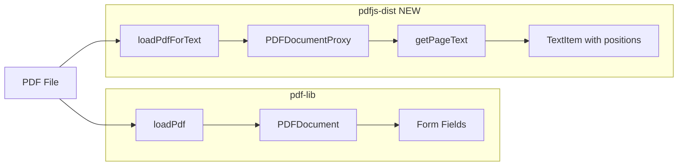

# Task 2.3: Text Extraction - Implementation Plan

## Summary

Add text extraction capabilities using pdfjs-dist to extract text content from PDF pages, including text positions for future field context features. Update Node.js version to latest stable LTS.

## Architecture



## Implementation Steps

### 1. Update Node.js Version

**Current:** `>=20.0.0`

**New:** `>=22.0.0` (Node.js 22 LTS - latest stable)

Files to update:

- [`package.json`](package.json) - Update `engines.node` field
- Create `.nvmrc` with `22` (or `lts/*` for automatic LTS tracking)

pdfjs-dist v5.x requires Node.js >= 20.16.0, so Node 22 LTS is fully compatible.

### 2. Install pdfjs-dist

```bash
pnpm add pdfjs-dist
```

### 3. Create `src/pdf/text.ts`

New file with the following functions:

| Function | Purpose |

|----------|---------|

| `extractPageText(filePath, page)` | Extract all text from a specific page |

| `extractAllText(filePath)` | Extract text from all pages |

| `extractTextWithPositions(filePath, page)` | Extract text items with x,y positions (for Task 3.3 field context) |

**Key implementation details:**

- Use `pdfjs-dist/legacy/build/pdf.mjs` for Node.js ESM compatibility
- Configure worker: `GlobalWorkerOptions.workerSrc`
- Handle page numbers (1-indexed to match pdf-lib convention)
- Reuse file validation from [`src/pdf/reader.ts`](src/pdf/reader.ts) patterns

**Types to add to [`src/pdf/types.ts`](src/pdf/types.ts):**

```typescript
interface TextItem {
  text: string;
  x: number;
  y: number;
  width: number;
  height: number;
}

interface PageText {
  page: number;
  text: string;
  items?: TextItem[];  // Optional, only when positions needed
}
```

### 4. Update exports in [`src/pdf/index.ts`](src/pdf/index.ts)

Add exports for the new text extraction functions.

### 5. Write unit tests in `tests/pdf/text.test.ts`

Test cases:

- Extract text from single page
- Extract text from multi-page document
- Extract text with positions
- Handle page with no text
- Handle invalid page number
- Handle empty PDF

Use existing test fixtures: `simple-form.pdf`, `multi-page.pdf`, `empty.pdf`

## Files to Create/Modify

| File | Action |

|------|--------|

| `.nvmrc` | **Create** - Node.js version file (`22`) |

| `package.json` | Update engines.node to `>=22.0.0`, add pdfjs-dist |

| `src/pdf/text.ts` | **Create** - Text extraction functions |

| `src/pdf/types.ts` | Add TextItem, PageText interfaces |

| `src/pdf/index.ts` | Export new functions |

| `tests/pdf/text.test.ts` | **Create** - Unit tests |

## Quality Gates

Before marking complete:

- `pnpm test` - All tests pass
- `pnpm run lint` - No lint errors  
- `pnpm run build` - Build succeeds

## Risks and Mitigations

| Risk | Mitigation |

|------|------------|

| Worker setup complexity in Node.js | Use legacy build which has simpler worker handling |

| Type definitions may be incomplete | Import types from `pdfjs-dist/types/src/display/api` |

| Test PDFs may not have extractable text | Test fixtures already include `drawText()` calls |