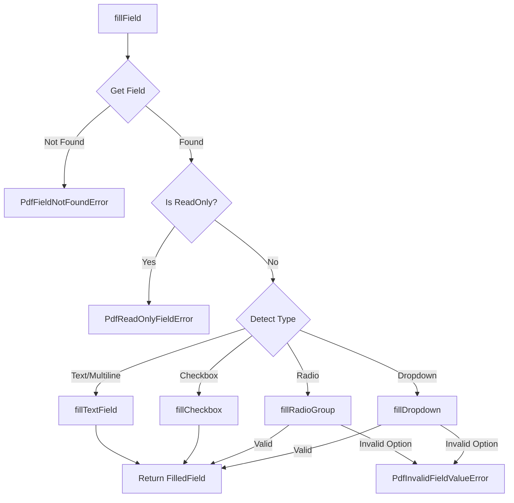

# Task 2.4: Field Filling - Implementation Plan

## Overview

Implement form field filling operations in `src/pdf/writer.ts` using pdf-lib. The main function `fillField()` will accept a field name and value, detect the field type, validate the input, and fill the field appropriately.

## Architecture



## Implementation Steps

### Step 1: Add New Error Types

Add to [`src/pdf/errors.ts`](src/pdf/errors.ts):

```typescript
export class PdfReadOnlyFieldError extends PdfError {
  readonly code = PdfErrorCode.ReadOnlyField;
  constructor(fieldName: string) {
    super(`Field '${fieldName}' is read-only and cannot be modified`);
  }
}

export class PdfInvalidFieldValueError extends PdfError {
  readonly code = PdfErrorCode.InvalidFieldValue;
  constructor(fieldName: string, value: string, options: string[]) {
    super(`Invalid value '${value}' for field '${fieldName}'. Valid options: ${options.join(', ')}`);
  }
}
```

Add error codes to [`src/pdf/types.ts`](src/pdf/types.ts):

```typescript
export enum PdfErrorCode {
  // ... existing codes
  ReadOnlyField = 'READ_ONLY_FIELD',
  InvalidFieldValue = 'INVALID_FIELD_VALUE',
}
```

### Step 2: Add FilledField Result Type

Add to [`src/pdf/types.ts`](src/pdf/types.ts):

```typescript
export interface FilledField {
  name: string;
  type: PdfFieldType;
  value: string | boolean;
  previousValue: string | boolean | null;
}
```

### Step 3: Create writer.ts

Create [`src/pdf/writer.ts`](src/pdf/writer.ts) with:

**Main function:**

```typescript
export function fillField(
  document: PDFDocument,
  fieldName: string,
  value: string | boolean
): FilledField
```

**Implementation flow:**

1. Get the form from document: `document.getForm()`
2. Find field by name using `form.getFields().find()`
3. Throw `PdfFieldNotFoundError` if not found
4. Check `field.isReadOnly()` - throw `PdfReadOnlyFieldError` if true
5. Detect field type using existing pattern from `fields.ts`
6. Dispatch to type-specific internal functions:

   - `fillTextField(field: PDFTextField, value: string)`
   - `fillCheckbox(field: PDFCheckBox, value: boolean)`
   - `fillRadioGroup(field: PDFRadioGroup, value: string)` - validate option exists
   - `fillDropdown(field: PDFDropdown, value: string)` - validate option exists

7. Return `FilledField` with name, type, new value, and previous value

**Key patterns from research:**

- Text fields: `field.setText(value.toString().trim())`
- Checkboxes: `value ? field.check() : field.uncheck()`
- Radio/Dropdown: Validate `field.getOptions().includes(value)` before `field.select(value)`

### Step 4: Export from Index

Update [`src/pdf/index.ts`](src/pdf/index.ts) to export:

- `fillField` function
- `FilledField` type
- New error classes

### Step 5: Write Unit Tests

Create [`tests/pdf/writer.test.ts`](tests/pdf/writer.test.ts) with test cases:

**Text Field Tests:**

- Fill empty text field with string
- Fill text field with multiline text (for multiline fields)
- Verify previous value is captured

**Checkbox Tests:**

- Check an unchecked checkbox (true)
- Uncheck a checked checkbox (false)

**Radio Group Tests:**

- Select valid option
- Error on invalid option (not in options list)

**Dropdown Tests:**

- Select valid option
- Error on invalid option

**Error Cases:**

- `PdfFieldNotFoundError` - field doesn't exist
- `PdfReadOnlyFieldError` - field is read-only
- `PdfInvalidFieldValueError` - invalid dropdown/radio value

**Verification Tests:**

- After filling, re-extract field and verify value persisted

## Files to Create/Modify

| File | Action |

|------|--------|

| [`src/pdf/writer.ts`](src/pdf/writer.ts) | Create - Main implementation |

| [`src/pdf/errors.ts`](src/pdf/errors.ts) | Modify - Add 2 error classes |

| [`src/pdf/types.ts`](src/pdf/types.ts) | Modify - Add error codes and FilledField type |

| [`src/pdf/index.ts`](src/pdf/index.ts) | Modify - Export new functions/types |

| [`tests/pdf/writer.test.ts`](tests/pdf/writer.test.ts) | Create - Unit tests |

## Quality Verification

After implementation:

```bash
pnpm run check  # lint + typecheck + test
```

Expected: All tests pass, no lint errors, build succeeds.