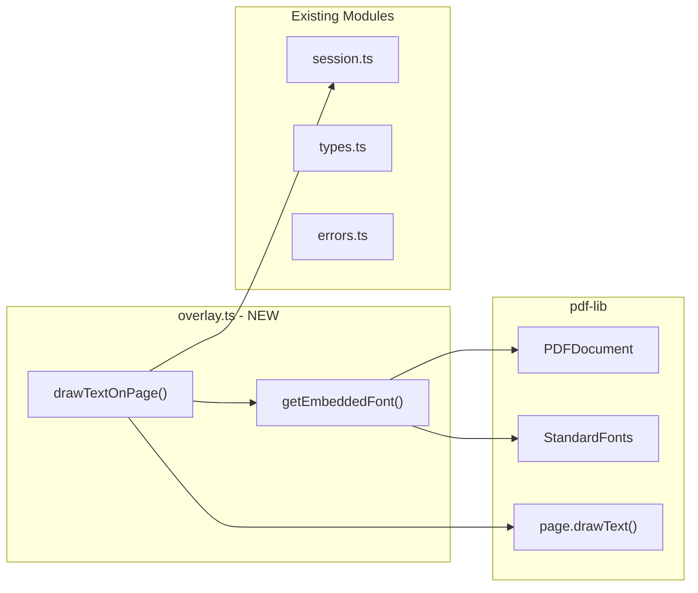

# Task 1.1: Text Overlay Foundation

## Overview

Create the foundational PDF text overlay functionality that will power the `draw_text` MCP tool. This module uses pdf-lib's `page.drawText()` API to place text at specific coordinates on PDF pages.

## Architecture



## Implementation Details

### 1. Add Types to [`src/pdf/types.ts`](src/pdf/types.ts)

```typescript
/** Supported standard fonts for text overlay */
export type StandardFontName = 'Helvetica' | 'TimesRoman' | 'Courier';

/** Options for drawing text on a PDF page */
export interface TextOverlayOptions {
  /** Text content to draw */
  text: string;
  /** X coordinate (points from left edge) */
  x: number;
  /** Y coordinate (points from bottom edge) */
  y: number;
  /** Page number (1-indexed) */
  page: number;
  /** Font size in points (default: 12) */
  fontSize?: number;
  /** Font name (default: 'Helvetica') */
  fontName?: StandardFontName;
}

/** Result of drawing text on a page */
export interface TextOverlayResult {
  /** Text that was drawn */
  text: string;
  /** X coordinate where text was placed */
  x: number;
  /** Y coordinate where text was placed */
  y: number;
  /** Page number */
  page: number;
  /** Font size used */
  fontSize: number;
  /** Font name used */
  fontName: StandardFontName;
}
```

### 2. Add Error Class to [`src/pdf/errors.ts`](src/pdf/errors.ts)

```typescript
/**
 * Error thrown when coordinates are outside page bounds
 */
export class PdfOutOfBoundsError extends PdfError {
  readonly code = PdfErrorCode.InvalidFieldValue; // Reuse existing code

  constructor(
    public readonly coordinate: 'x' | 'y',
    public readonly value: number,
    public readonly max: number
  ) {
    super(`${coordinate.toUpperCase()} coordinate ${value} is out of bounds (0-${max})`);
  }
}
```

**Note:** This follows the existing error class pattern where:

- `code` is defined as a readonly class property (not passed to super())
- `super()` only receives the message string
- The `name` property is auto-set by the base `PdfError` class

### 3. Create [`src/pdf/overlay.ts`](src/pdf/overlay.ts) (NEW)

Key functions:

```typescript
import { PDFDocument, StandardFonts, rgb, type PDFFont } from 'pdf-lib';

// Font cache: Map<documentId, Map<fontName, PDFFont>>
const fontCache = new WeakMap<PDFDocument, Map<string, PDFFont>>();

/**
 * Get or embed a standard font for the document.
 * Caches fonts per document to avoid re-embedding.
 */
async function getEmbeddedFont(
  doc: PDFDocument,
  fontName: StandardFontName
): Promise<PDFFont>

/**
 * Draw text at specific coordinates on a PDF page.
 * 
 * @param doc - The PDFDocument instance (from session)
 * @param options - Text overlay options
 * @returns Result with confirmation of what was drawn
 * @throws {PdfInvalidPageError} If page number is out of range
 * @throws {PdfOutOfBoundsError} If coordinates are outside page bounds
 */
export async function drawTextOnPage(
  doc: PDFDocument,
  options: TextOverlayOptions
): Promise<TextOverlayResult>
```

Implementation approach:

- Use `WeakMap` for font caching (auto-cleanup when document is garbage collected)
- Map font names to `StandardFonts` enum values using a mapping object:
  ```typescript
  const FONT_MAP: Record<StandardFontName, (typeof StandardFonts)[keyof typeof StandardFonts]> = {
    Helvetica: StandardFonts.Helvetica,
    TimesRoman: StandardFonts.TimesRoman,
    Courier: StandardFonts.Courier,
  };
  ```

- Validate page exists using `doc.getPageCount()`
- Validate coordinates: reject negative values and values beyond page dimensions
- Get page dimensions with `page.getSize()` for bounds validation
- Call `page.drawText()` with embedded font
- Default color: black (`rgb(0, 0, 0)`)

### 4. Update [`src/pdf/index.ts`](src/pdf/index.ts)

Export new types and function:

```typescript
export type { StandardFontName, TextOverlayOptions, TextOverlayResult } from './types.js';
export { PdfOutOfBoundsError } from './errors.js';
export { drawTextOnPage } from './overlay.js';
```

### 5. Create [`tests/pdf/overlay.test.ts`](tests/pdf/overlay.test.ts) (NEW)

Test cases:

**Successful drawing:**

- Draw text with default options (Helvetica, 12pt)
- Draw text with each supported font (TimesRoman, Courier)
- Draw text with custom font size
- Draw text at origin (0, 0) - boundary edge case
- Draw text at page boundaries (x = width, y = height) - should succeed or fail depending on design
- Multiple draws on same page
- Font caching works (same font not re-embedded)

**Invalid page errors:**

- Error: page 0 (1-indexed, so 0 is invalid)
- Error: negative page number
- Error: page beyond document length

**Out of bounds coordinate errors:**

- Error: negative X coordinate (x < 0)
- Error: negative Y coordinate (y < 0)
- Error: X coordinate beyond page width
- Error: Y coordinate beyond page height

**Error properties:**

- PdfOutOfBoundsError has correct error code
- PdfOutOfBoundsError includes coordinate name in message
- PdfOutOfBoundsError includes value and max in message

## File Changes Summary

| File | Action | Description |

|------|--------|-------------|

| [`src/pdf/types.ts`](src/pdf/types.ts) | Modify | Add `StandardFontName`, `TextOverlayOptions`, `TextOverlayResult` |

| [`src/pdf/errors.ts`](src/pdf/errors.ts) | Modify | Add `PdfOutOfBoundsError` class |

| [`src/pdf/overlay.ts`](src/pdf/overlay.ts) | Create | Main overlay module with `drawTextOnPage()` |

| [`src/pdf/index.ts`](src/pdf/index.ts) | Modify | Export new types and functions |

| [`tests/pdf/overlay.test.ts`](tests/pdf/overlay.test.ts) | Create | Unit tests for overlay functionality |

## Design Decisions

1. **Font caching with WeakMap**: Fonts are cached per-document using WeakMap so they're automatically cleaned up when the document is no longer referenced.

2. **Bounds validation enabled by default**: Coordinates outside page bounds will throw an error to prevent invisible text. This helps AI clients catch mistakes early.

3. **Black text only**: For v2 simplicity, text is always black. Color support can be added later if needed.

4. **1-indexed pages in API, 0-indexed internally**: User-facing API uses 1-indexed pages (consistent with other tools), but pdf-lib uses 0-indexed internally.

## Quality Gates

After implementation:

- `pnpm test` - All tests pass (including new overlay tests)
- `pnpm run lint` - No lint errors
- `pnpm run build` - Build succeeds